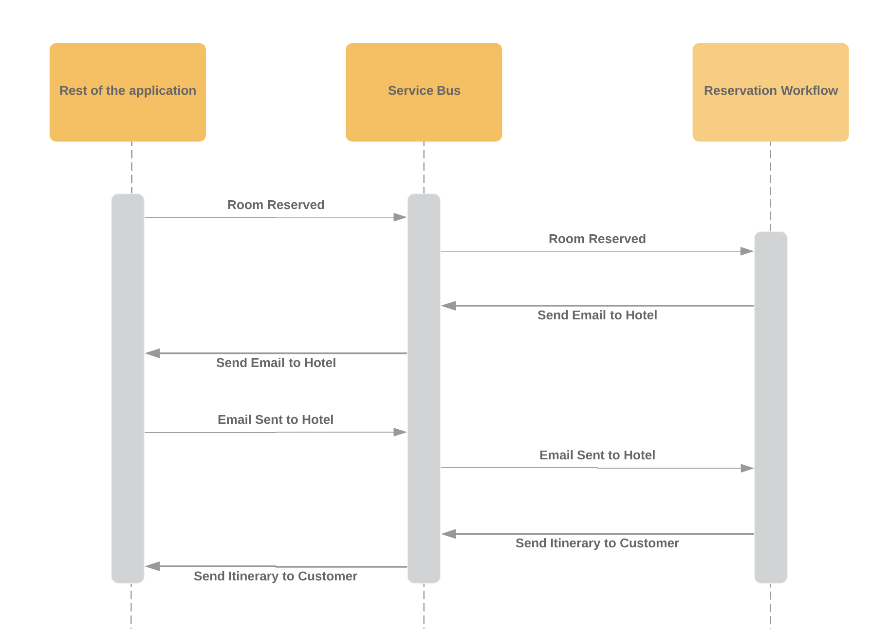

# @node-ts/bus

**A service bus for message-based, distributed node applications.**

[](https://greenkeeper.io/)
[](https://circleci.com/gh/node-ts/bus/tree/master)[](https://opensource.org/licenses/MIT) <iframe src="https://ghbtns.com/github-btn.html?user=node-ts&repo=bus&type=star&count=true" frameborder="0" scrolling="0" width="80px" height="20px"></iframe>
<iframe src="https://ghbtns.com/github-btn.html?user=node-ts&repo=bus&type=watch&count=true&v=2" frameborder="0" scrolling="0" width="170px" height="20px"></iframe>

View our docs at [https://node-ts.github.io/bus/](https://node-ts.github.io/bus/)

## Overview

This framework provides a way to connect different applications or parts of the same application together in a developer-friendly way powered by message queues. It helps to decouple and greatly simplify applications, especially as they grow larger.

The simplest way to imagine a message based system is the following:

- Your system, as a whole, can accept and process `commands`
- When a command is executed, one or more `events` are published
- The system can listen for certain `events` and trigger other `commands` because of it

For example consider an online hotel booking message based system:

- A `command` like `ReserveRoom` is sent when a new reservation is made
- Upon processing this `command`, a `RoomReserved` event is published
- Whenever a `RoomReserved` `event` is received, a `SendEmailToHotel` `command` is sent

This library can be combined with the Domain Driven Design library [@node-ts/ddd](https://www.github.com/node-ts/ddd) that helps align software with the business domain.

## Components

This library consists of the following main components:

### Message Handlers

Message handlers are simple, stateless functions that are invoked each time a message that your application subscribes to is received. They take the message as an argument, perform an action based on the message, and then complete. 

Here's a simple message handler. Just declare a class that `HandlesMessage`, and this framework will automatically take care of configuring the underlying message transport so that your app receives these messages regardless of where it's sent from.

```typescript
@HandlesMessage(ReserveRoom)
export class ReserveRoomHandler {
  handles (command: ReserveRoom): void {
    roomService.reserve(command)
  }
}
```

For more information on handlers, see [@node-ts/bus-core/handlers](packages/bus-core/src/handler/)

For more information on message types, see [@node-ts/bus-messages](packages/bus-messages/)

### Workflows

Workflows orchestrate the business process logic in your application. Business processes are specific to your application and problem domain, and can be anything from carrying out the steps of an eCommerce site to process an order through to fulfilment, to managing a marketing campaign from start to finish.

Workflows are crucial in decoupling your application and keeping the ***how to do something*** separate from the ***when to do something***.

Consider the following business process that sends emails to the hotel, and then the customer when a hotel room is reserved:



Writing this process as a workflow is simple and resilient:

```typescript
export class ReservationWorkflow extends Workflow<ReservationWorkflowData> {

  constructor (
    @inject(BUS_SYMBOLS.Bus) private readonly bus: Bus
  ) {
    super()
  }

  /**
   * Start a new ReservationWorkflow each time a `RoomReserved` event is published
   */
  @StartedBy<RoomReserved, ReservationWorkflowData, 'handleRoomReserved'>(RoomReserved)
  async handleRoomReserved (roomReserved: RoomReserved): Promise<Partial<ReservationWorkflowData>> {
    // Notify the hotel that the room was reserved
    const notifyHotel = new SendEmailToHotel(
      roomReserved.roomId,
      roomReserved.fromDate,
      roomReserved.toDate
    )
    await this.bus.send(notifyHotel)

    // Add the room id to the workflow state
    return {
      customerId: roomReserved.customerId,
      roomId: roomReserved.roomId
    }
  }

  /**
   * Once the email has been sent to the hotel notifying them of the booking, send the
   * itinerary to the customer.
   */
  @Handles<EmailSentToHotel, ReservationWorkflowData, 'handleEmailSentToHotel'>(EmailSentToHotel, event => event.roomId, 'roomId')
  async handleEmailSentToHotel (event: EmailSentToHotel, data: ReservationWorkflowData): Promise<Partial<ReservationWorkflowData>> {
    // The current workflow state is injected into each handler
    const sendItineraryToCustomer = new SendItineraryToCustomer(
      data.customerId,
      data.roomId
    )
    await this.bus.send(sendItineraryToCustomer)

    // Nothing left to do for this workfow, so mark it as complete
    return this.complete()
  }

}
```

This workflow coordinates a number of different systems without any knowledge of where they are or how they work. It does no work except to orchestrate individual actions (commands) to perform a larger process.

For more information, see [@node-ts/bus-workflow](/packages/bus-workflow/)

### Transports

Transports are message brokers that are use by this library for communication. RabbitMQ, AWS SQS, Kafka, MSMQ etc are all examples of message queueing technology that can be used. The choice of transport is largely irrelevant for the developer, as this library abstracts all of those complexities away. 

Currently transport adapters for RabbitMQ and AWS SQS have been written, but implementing one for a different technology is simple.

For more information, see [@node-ts/bus-core/transport](/packages/bus-core/src/transport/)

